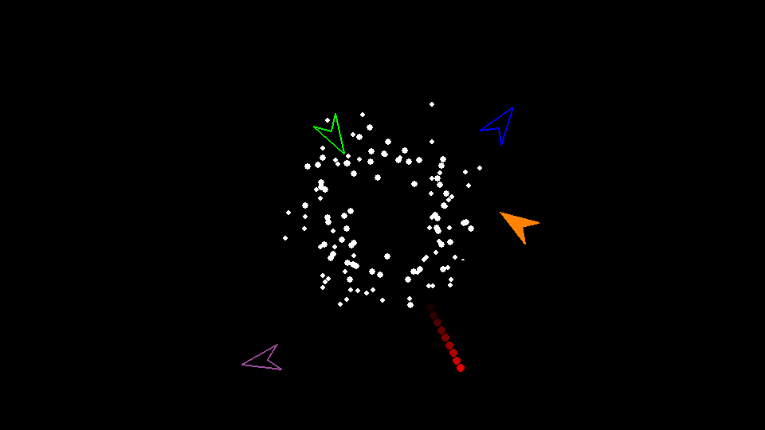

# MpGameServer

A Python 3.8+ UDP Client and Server for building multiplayer games with a focus on security and ease of use.

MpGameServer abstracts all of the complexities with handling network connections and multithreading so that
you can focus on building an event driven game server.

The network protocol is based on the work of [Glenn Fiedler's Gaffer On Games](https://www.gafferongames.com)

* [Installation](#installation)
* [Features](#features)
* [Performance](#performance)
* [Security](#security)
* [Roadmap](#roadmap)
* Documentation
    * [Echo Server Example](docs/example.md)
    * [PyGame Example](docs/example2.md)
    * [Getting Started](docs/GettingStarted.md)
    * [Network Protocol](docs/network.md)
    * [Production Deployment](docs/ProductionDeployment.md)
* API Documentation
    * [Client](docs/client.md)
    * [Server](docs/server.md)
    * [HTTP/TCP/WebSockets](docs/http.md)
    * [Cryptography](docs/crypto.md)
    * [Serialization](docs/serializable.md)
    * [Event Dispatch](docs/event_dispatch.md)
    * [Pygame Engine](docs/engine.md)
    * [Misc.](docs/misc.md)
    * [Experimental](docs/experimental.md)



## Installation

MpGameServer has an optional installation of pygame.

```bash
pip install mpgameserver[pygame]
```

## Features

* UDP Client and Server
* Supports Windows, OSX, Linux
* End to End Authenticated Encryption
* IPv4 and IPv6 support
* Mitigations for DDOS amplification attacks
* Detect (and reject) corrupt or tampered packets
* Reject duplicate datagrams, and duplicate messages.
* Optional guaranteed datagram delivery
* Automatic message fragmentation for messages larger than the maximum packet payload size
* Combines small messages into a single datagram
* Connection metrics including datagram latency, datagrams per second sent and received, bytes per second sent and received.
* Configurable Server IP block list
* Configurable MTU size

## Installation

You can install MpGameServer from [PyPI](https://pypi.org/project/mpgameserver/)

```
pip install mpgameserver
```

MpGameServer supports python 3.8+

## How To Use

Read the [Getting Started](docs/GettingStarted.md) guide for how to use this package with PyGame.

## Security

Datagrams are encrypted using AES-GCM. A unique key is generated for every
connection using ECDH and ECDSA. The elliptic curve SECP256R1 is used.
This provides Authentication (a client can verify it is communicating with the correct server),
Integrity (the client and server can detect if a message has been modified)
Confidentiality (unauthorized users are not able to decrypt the messages.)

## Performance

The performance goal for this server is to handle 128 concurrent connections, each sending 32 datagrams per second, with 60 server ticks per second.

The primary bottleneck is the encryption or decryption of datagrams. The limit
is about 40,000 datagrams per second (depending on hardware). In practice this
translates to sending or receiving around 3000 datagrams per second,
if any practical workload is performed on each datagram.

The second limitation is that the ack bits in the header only contains 32 bits.
The implicit assumption is that there will not be more than 32 unacked datagrams in flight.
This puts a limit of 32 datagrams per second, the default timeout. Sending more datagrams
than this limit can result in datagrams that are received by the remote client, but
are not acked on the sending side. A game or server running at 60 frames per second
should take care to structure sending messages to avoid hitting this limit.
Note that 32 datagrams per second is a transfer rate of about 45KB per second.

## Road map
* Client Side Prediction (CSP) / Server Side Prediction (SSP)
  * A half baked solution is almost ready to be merged.
* Entity Component System
* Connection throttling based on latency
* Use X509 certificates for server authentication. The current EC key solution is somewhat hacky.
* Ability to send multiple packets per tick/frame.
* Better retry logic for sending. Currently only retry on timeout is supported.
* Support for message de-duplication and strong ordering. While individual datagram packets are de-duplicated, the current
  best way to de-duplicated individual messages is to embed a SeqNum.
* An API to allow a client to get the metrics from a headless server. A metrics dashboard for a headless client
* detect packet flooding and prevent sending if there are too many datagrams in flight
* Utilities to help with user account creation, with a database independent API.
