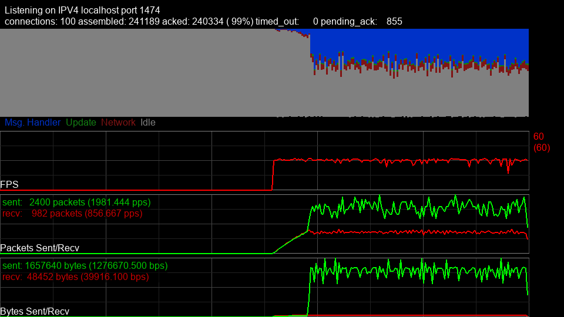

[Home](../README.md)

# Server

The server is made up of three main components: The EventHandler, ServerContext and the Server itself.

The ServerContext is used to configure the behavior of the server at runtime.
The EventHandler contains all of the game logic, and reacts to server events
such as clients connecting, disconnecting, and receiving messages.

There are two implementations for the Server: The TwistedServer is based on
the twisted python library. The GuiServer further wraps the twisted server
into a pygame gui.

* [EventHandler](#eventhandler)
* [EventHandler.Client](#eventhandler.client)
* [ServerContext](#servercontext)
* [TwistedServer](#twistedserver)
* [GuiServer](#guiserver)
* [ConnectionStatus](#connectionstatus)
* [RetryMode](#retrymode)
---
## :large_blue_diamond: EventHandler
Base class for user defined game logic.

In your game, create a subclass from `EventHandler` and then implement the event handler methods. Pass an instance of EventHandler to a [ServerContext](#servercontext) instance

The EventHandler events are guaranted to always be run from the same thread.

#### Methods:

* :small_blue_diamond: **`connect`**`(self, client)` - client connection event

  * **:arrow_forward: `client:`** the client instance that connected

  This event is raised when a client successfully completes the handshake

  > :bulb: In order to send a message to all connected clients, record connections in a map client.token => client. Remove clients when they disconnect. Then you can use the map to get all connected clients and call send on each one with the message.

  

* :small_blue_diamond: **`disconnect`**`(self, client)` - client disconnect event

  * **:arrow_forward: `client:`** the client instance that disconnected

  This event is raised when a client disconnects or timeouts

  

* :small_blue_diamond: **`handle_message`**`(self, client, seqnum, msg: bytes = b'')` - receive client message event

  * **:arrow_forward: `client:`** the client that sent the message

  * **:arrow_forward: `seqnum:`** 

  * **:arrow_forward: `msg:`** the message

  This event is raised whenever a message is received from a remote client. If a datagram contained multiple messages, then this event will be raised once for each message.

  

* :small_blue_diamond: **`shutdown`**`(self)` - server shutdown event

  This event is raised when the server is shutting down gracefully. It is the last event that will be called before the process exits

  > :x: Do not depend on this event being raised. The server does not guarantee that this method will be called in the event of a crash or SIGKILL.

  

* :small_blue_diamond: **`starting`**`(self)` - server starting event

  This event is raised when the server first starts

  

* :small_blue_diamond: **`update`**`(self, delta_t: float)` - server tick event

  * **:arrow_forward: `delta_t:`** elapsed time in seconds since the last update

  This event is raised once per server tick

  

---
## :large_blue_diamond: EventHandler.Client
Many of the events in EventHandler receive a client. That client implements the public API defined here.

#### Public Attributes:

**`addr`**: the client remote address. a 2-tuple: (host, port). This is unique per client, but may also contain PII and should not be sent to other clients

**`latency`**: this current connection latency (average time it takes for the remote to receive the datagram)

**`log`**: an instance of logging.Logger which logs with client context

**`stats`**: this connections ConnectionStats

**`token`**: unique id for this client session. It is safe to use this token to uniquely identify a client as well as share the token value with other users

#### Methods:

* :small_blue_diamond: **`disconnect`**`(self)` - force the server to drop the connection

  

* :small_blue_diamond: **`send`**`(self, payload: bytes, retry: mpgameserver.connection.RetryMode = RetryMode.NONE, callback: Callable[[bool], NoneType] = None)` - send a message to the remote client/server

  * **:arrow_forward: `payload:`** 

  * **:arrow_forward: `retry:`** the RetryMode, default to RetryMode.NONE

  * **:arrow_forward: `callback:`** a function which is called when the message has been acked or after a timeout. The function should accept a single boolean which is true when the message is acked and false otherwise.

  

* :small_blue_diamond: **`send_guaranteed`**`(self, payload: bytes, callback: Callable[[bool], NoneType] = None)` - send the message and guarantee delivery by using RetryMode.RETRY_ON_TIMEOUT

  * **:arrow_forward: `payload:`** 

  * **:arrow_forward: `callback:`** a function which is called when the message has been acked or after a timeout. The function should accept a single boolean which is true when the message is acked and false otherwise.

  

---
## :large_blue_diamond: ServerContext
The ServerContext holds the configuration for the server.

This class is not thread safe. the configuration should be set prior to calling the run method of the server

#### Constructor:

* :small_blue_diamond: **`ServerContext`**`(self, handler, root_key=None)` - 

  * **:arrow_forward: `handler:`** an instance of an EventHandler

  * **:arrow_forward: `root_key:`** an EllipticCurvePrivateKey used for signing messages. The client will use the public key to to verify the signature. If not given a new key is generated automatically. Note: It is strongly encouraged to provide your own private key, and to pre-share the corresponding public key with the client. Doing so can avoid a man-in-the-middle attack.

  

#### Methods:

* :small_blue_diamond: **`enableAccessLogs`**`(self, path)` - configure an alternative file path for logging IP addresses that connect to the server

  * **:arrow_forward: `path:`** a file path or None to disable access logging

  

* :small_blue_diamond: **`setBlockList`**`(self, blocklist: Set[str])` - set IP addresses to block.

  * **:arrow_forward: `blocklist:`** a set of IP addresses to block

  blocked IP addresses will have any datagrams received dropped before processing

  

* :small_blue_diamond: **`setConnectionTimeout`**`(self, timeout)` - configure the timeout for closing a connection if no message is received after a period of time.

  * **:arrow_forward: `timeout:`** the timeout in seconds. The default is 5 seconds.

  

* :small_blue_diamond: **`setInterval`**`(self, interval: float)` - configure the server tick rate (server frame rate)

  * **:arrow_forward: `interval:`** the seconds per server tick

  

* :small_blue_diamond: **`setKeepAliveInterval`**`(self, interval)` - configure the timeout for sending keep alive datagrams to clients.

  * **:arrow_forward: `interval:`** 

  

* :small_blue_diamond: **`setMessageTimeout`**`(self, timeout)` - configure the timeout for waiting for the ack for a datagram

  * **:arrow_forward: `timeout:`** the timeout in seconds. The default is 1 second.

  

* :small_blue_diamond: **`setTempConnectionTimeout`**`(self, timeout)` - configure the timeout for closing a connection if the connection handshake is not completed in time

  * **:arrow_forward: `timeout:`** the timeout in seconds. The default is 2 seconds.

  

* :small_blue_diamond: **`shutdown`**`(self)` - stop the server if it is running

  

---
## :large_blue_diamond: TwistedServer
a headless server implementation

#### Constructor:

* :small_blue_diamond: **`TwistedServer`**`(self, ctxt, addr, install_signals=True)` - 

  * **:arrow_forward: `ctxt:`** A [ServerContext](#servercontext) instance

  * **:arrow_forward: `addr:`** 2-tuple host, port host can be "::" to bind to an ipv6 address

  * **:arrow_forward: `install_signals:`** whether to install a default signal handler when running on UNIX style operating systems

  

#### Methods:

* :small_blue_diamond: **`listenTCP`**`(self, router, addr, privkey=None, cert=None)` - Enable a TCP listener. Must be called prior to run.

  * **:arrow_forward: `router:`** an router instance containing mapped endpoints

  * **:arrow_forward: `addr:`** a 2-tuple (host: str, port: int)

  * **:arrow_forward: `privkey:`** the path to a ssl private key

  * **:arrow_forward: `cert:`** the path to a ssl full chain certificate (pem file)

  

* :small_blue_diamond: **`run`**`(self)` - run the server.

  

* :small_blue_diamond: **`stop`**`(self)` - stop the server

  

---
## :large_blue_diamond: GuiServer
A server implementation which displays run time metrics in a pygame interface

1. A summary of lifetime packets assembled, acked, timed out and pending

2. Time Profiling: An area plot showing where the server is spending it's time, split into 4 categories. `Message Handling` is the time spent decrypting and processing datagrams. `Update` is the time spent in the update method of the event handler `Network` is the time spent encrypting and sending datagrams `Idle` is the time spent sleeping to maintain a steady tick rate

3. Frames Per Scond / Ticks Per Second - the number of times the main loop is run during a given second. Ideally this would be a constant value determined from the [ServerContext](#servercontext) interval. But can fluctuate due to the accuracy of the sleep timer and server workload

4. Packets Per Second - the Number of packets sent or received each second

5. Bytes Per Second - the total number of bytes in each packet sent or received.

#### Constructor:

* :small_blue_diamond: **`GuiServer`**`(self, ctxt, addr)` - a server which displays metrics in a pygame window

  * **:arrow_forward: `ctxt:`** A [ServerContext](#servercontext) instance

  * **:arrow_forward: `addr:`** The address to bind to. A 2-tuple (host, port). host can be "::" to bind to an ipv6 address

  

#### Methods:

* :small_blue_diamond: **`init`**`(self)` - init pygame

  

* :small_blue_diamond: **`listenTCP`**`(self, router, addr, privkey=None, cert=None)` - Enable a TCP listener. Must be called prior to run.

  * **:arrow_forward: `router:`** an router instance containing mapped endpoints

  * **:arrow_forward: `addr:`** a 2-tuple (host: str, port: int)

  * **:arrow_forward: `privkey:`** the path to a ssl private key

  * **:arrow_forward: `cert:`** the path to a ssl full chain certificate (pem file)

  

* :small_blue_diamond: **`run`**`(self)` - run the server.

  calls `init()` if it has not yet been run

  

---
## :large_orange_diamond: ConnectionStatus
The connection status

| Attribute | Enum Value | Description |
| :-------- | ---------: | :---------- |
| CONNECTING | 1 | the client is attempting to connect, keys are not set |
| CONNECTED | 2 | the client is connected, keys are set |
| DISCONNECTING | 3 | the client is closing the connection gracefully |
| DISCONNECTED | 4 | the client is not connected |
| DROPPED | 5 | the client lost communication with the server |
---
## :large_orange_diamond: RetryMode
The RetryMode is a per-message setting which controls how the message is delivered.

When using one of the retry modes, it is possible for the same message to be included in multiple datagrams. The protocol automatically detects and drops duplicate messages.

| Attribute | Enum Value | Description |
| :-------- | ---------: | :---------- |
| RETRY_ON_TIMEOUT | -1 | Send the message. If a timeout occurs automatically resend the message. The message will be sent in this fashion until received or the connection is closed. |
| NONE | 0 | Send the message, with no attempt at guaranteeing delivery or retrying. |
| BEST_EFFORT | 1 | Send the message. Then resend on the keep alive interval until the message is acked or the timeout duration is reached. Note: It is possible for the message to be received, but the timeout may still trigger. |
